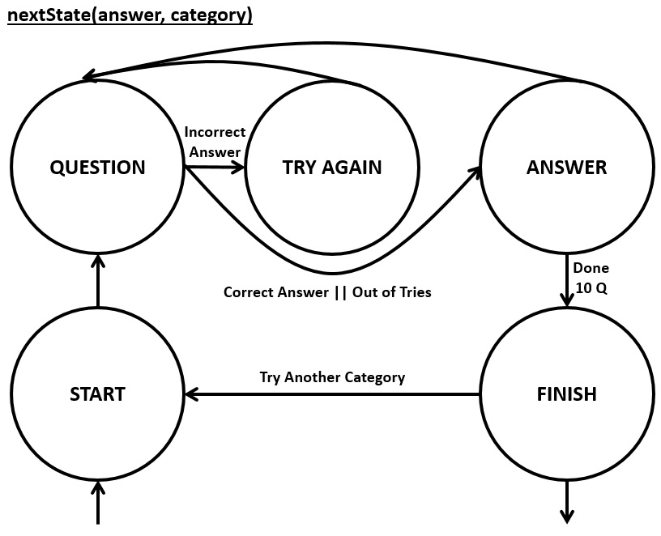
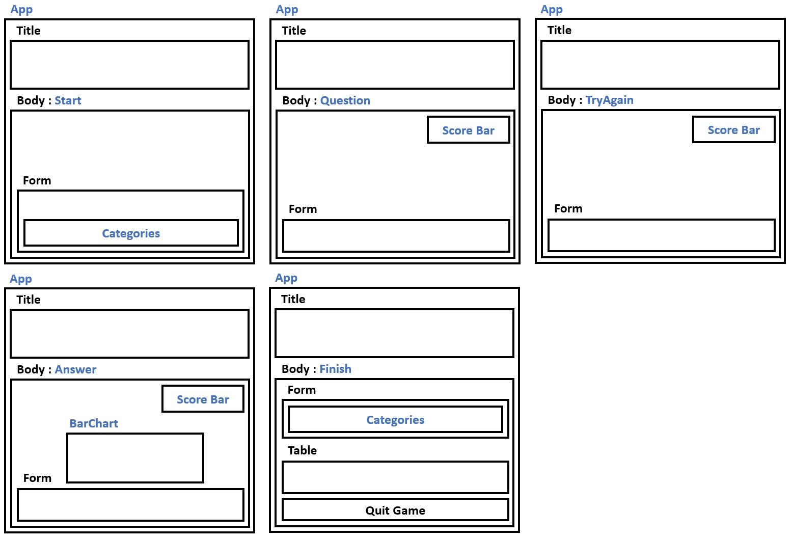

# Design
Jump to: [API](#API) | [State Diagram](#State-Diagram) | [Components](#Components)

## API
The following summarizes the different API flows from the App component to the Express.js router. The `src/api.js`
uses Axios get/post calls to the respective routes. The Express.js router then interacts directly with MongoDB.

| App Component                 | src/api.js                          | api/index.js |
| -------------                 | ---------------                     | ------ |
| fetchQuestion()1,2 | api.fetchQuestion(questionId)       | router.get(/question/:questionId) |
| addAnswer(questionId, answer) | api.addAnswer(questionId, answer)   | router.post(/question/:questionId) |
| fetchPlayer(playerName)       | api.fetchPlayer(playerName)         | router.get(/players/:playerName) |
| addPlayer()3       | api.addPlayer(player)               | router.post(/players) |
| fetchScores()                 | api.fetchScores()                   | router.get(/players) |

1 `fetchQuestion()` uses a random number generator to repeatedly generate a questionId, until the questionId corresponds to a question not yet attempted by the player \
2 `api.fetchQuestion(questionId)` is also once called directly from the nextState method, to fetch the updated list of answers for the given question \
3 `addPlayer()` constructs the current player object based on the information stores in the App component's object

## State Diagram
The next state is determined by the `nextState(answer, category)` function in the App component. The logic of this function is summarized in the following diagram.

## Components
The main App component consists of the page title, of the body, and optionally includes the ScoreBar component. The body component is either the Start, Question, TryAgain, Answer or Finish component depending on the current state of the application. The ScoreBar component is displayed when the application is one of the following states: Question, TryAgain or Answer. The BarChart component is displayed within the Answer component.

The Start or Finish components display the Categories component which generates the buttons that allow the player to choose the next category. The Finish component displays the leaderboard as an HTML table. On the following diagram, all component names are highlighted in blue, while black captions correspond to routine HTML elements.

Screenshots of all components can be viewed [here](screenshots.md)

