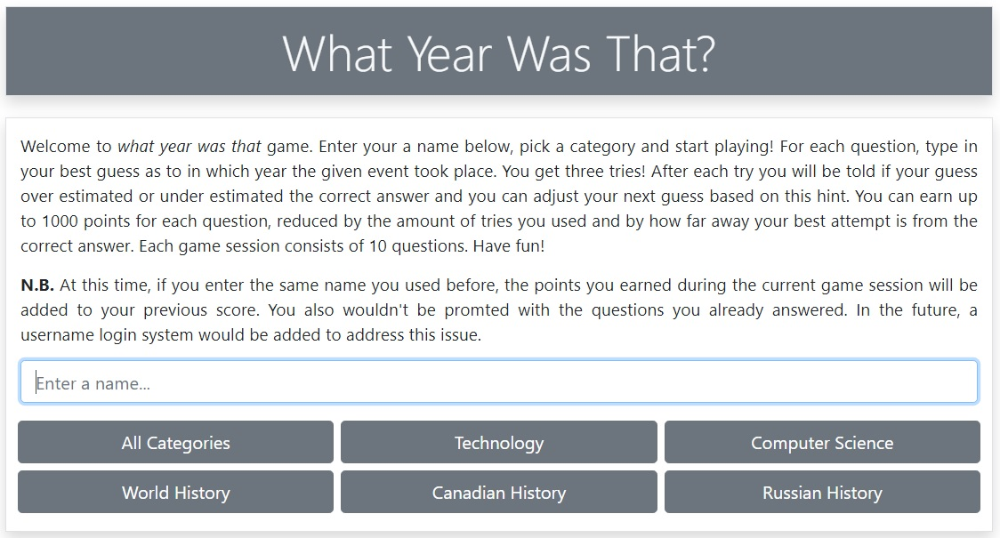
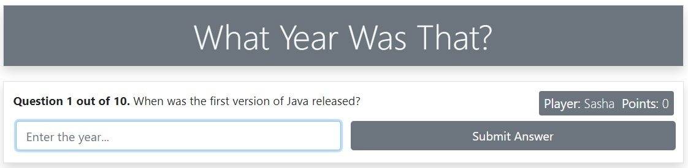
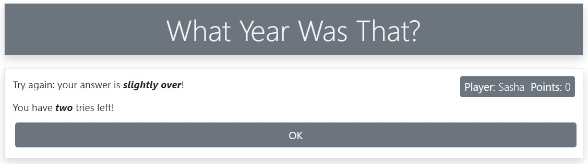
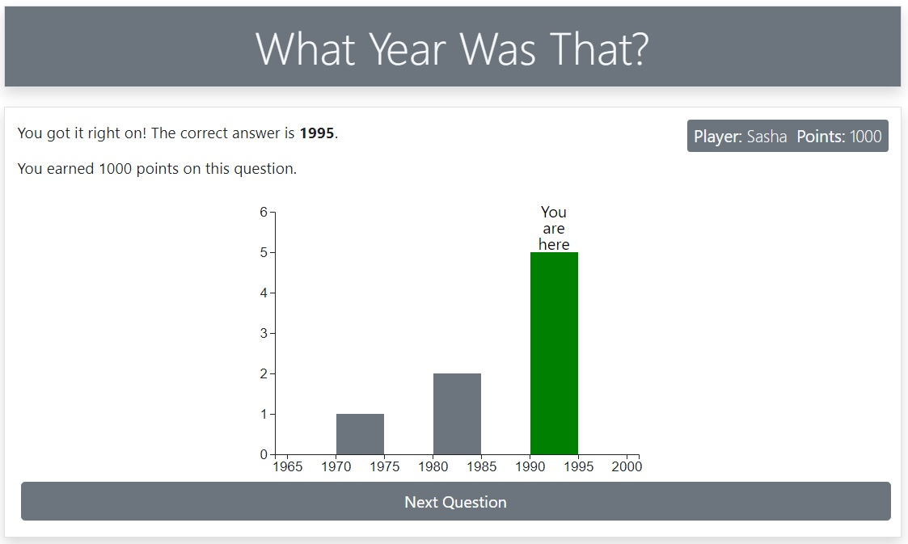
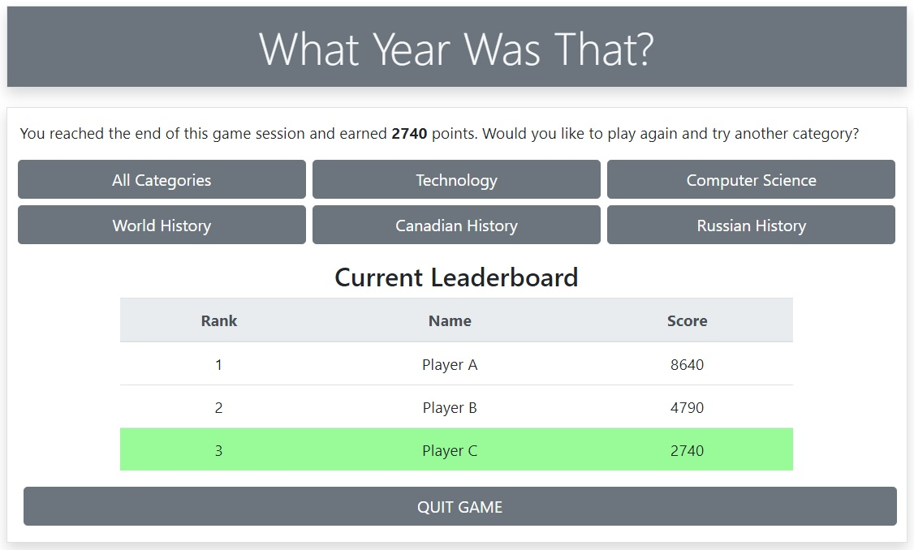

# App Screenshots

**State: Start**

**State: Question**

**State: Try Again**

**State: Answer**

**State: Finish**

The current leaderboard displays the top 10 players and highlights the current player. Should the current player's rank be outside of the top 10, the row corresponding to the current player will also be tagged onto the bottom.
